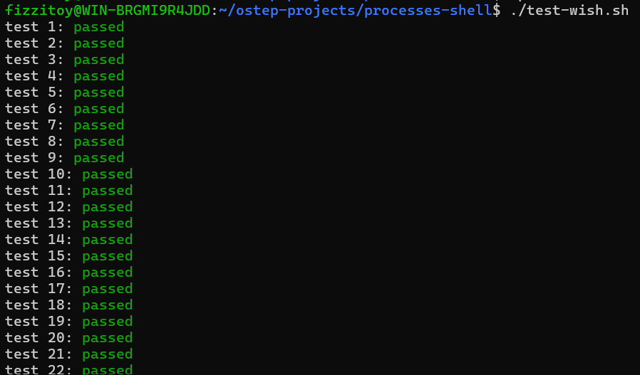

# Wish Shell

A simple Unix shell implemented in C as part of the OSTEP Shell project.

## Features

- Interactive shell mode with the `wish> ` prompt
- Batch mode for executing commands from a file
- Built-in commands:
  - `exit`
  - `cd`
  - `path`
- Execution of external programs
- Configurable executable search paths
- Output and error redirection using `>`
- Parallel command execution using `&`
- Support for operators with or without surrounding whitespace
- Error handling without terminating the shell

## Technologies and System Calls

The project was developed and tested using:

- C
- GCC
- Linux / WSL2
- Git and GitHub

Main functions and system calls used in the implementation:

- `fork()` — creates a child process
- `execv()` — executes an external program
- `waitpid()` — waits for child processes
- `access()` — checks whether an executable is available
- `chdir()` — changes the current working directory
- `open()` — opens or creates files for redirection
- `dup2()` — redirects standard output and standard error
- `getline()` — reads command lines
- `strsep()` — parses command input

## Build

```bash
gcc wish.c -o wish
```

## Usage

Interactive mode:

```bash
./wish
```

Batch mode:

```bash
./wish commands.txt
```

Example:

```text
wish> echo hello
hello
wish> echo one & echo two
one
two
wish> echo hello > output.txt
```

## Testing

The implementation passes all **22/22 official OSTEP Shell tests**.


